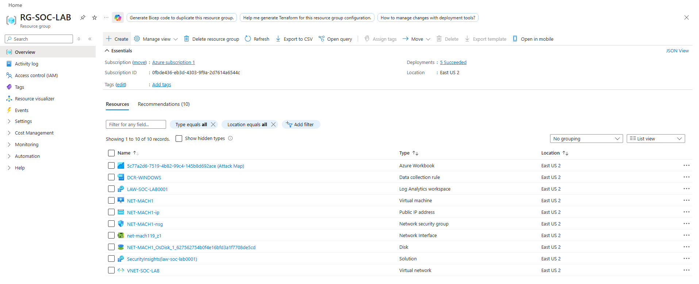
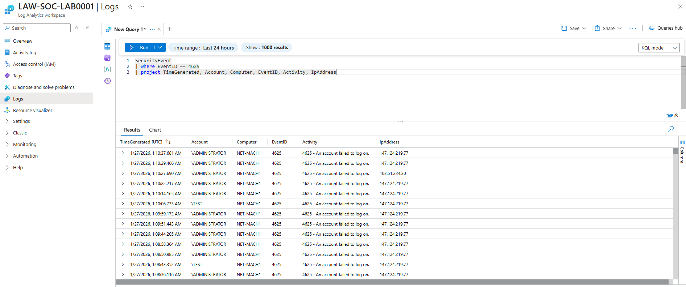
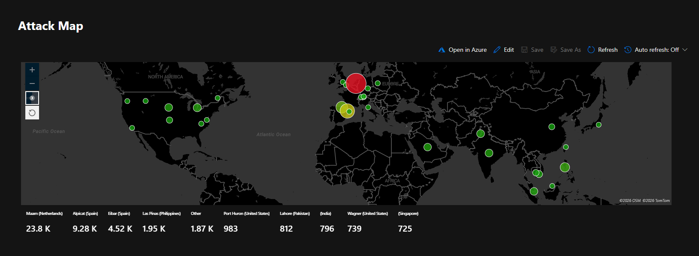
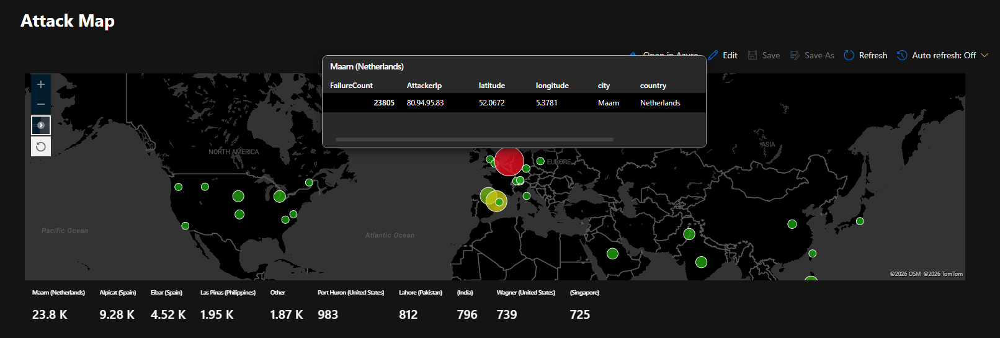
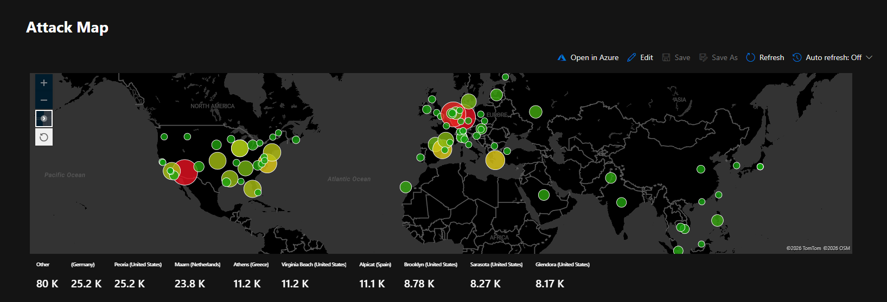
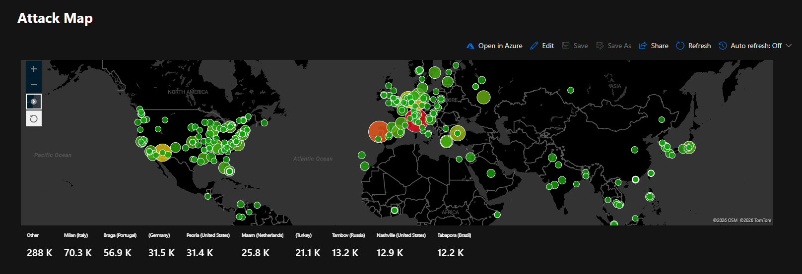

# SOC & Honeynet Lab in Azure  
## Building a Mini SOC + SIEM + Attack Map

Welcome to the **SOC & Honeynet Lab in Azure**.

This project demonstrates how to build a small-scale **Security Operations Center (SOC)** environment in the cloud using Microsoft Azure. In this lab, I deployed an exposed Windows honeypot, forwarded security logs into Microsoft Sentinel (SIEM), enriched attacker IP data with GeoIP intelligence, and visualized global attack activity on a live map.

This project simulates real-world SOC monitoring and blue team workflows.

---

# 🏗 Lab Architecture Overview

This lab is fully deployed in Microsoft Azure and includes:

- Resource Group (`RG-SOC-LAB`)
- Virtual Network / Honeynet (`VNET-SOC-LAB`)
- Windows 10 Honeypot VM (`NET-MACH1`)
- Log Analytics Workspace (`LAW-SOC-LAB0001`)
- Microsoft Sentinel (SIEM)
- GeoIP Watchlist
- Attack Map Workbook

### Attack Flow

1. A Windows 10 VM is exposed to the public internet.
2. Attackers attempt remote logins.
3. Failed login attempts (Event ID 4625) are generated.
4. Logs are forwarded to Log Analytics.
5. Microsoft Sentinel ingests and analyzes the logs.
6. GeoIP data enriches attacker IP addresses.
7. A workbook visualizes attack sources on a global map 🌍

---

# 🔐 PART I — Creating the Honeynet & Honeypot

## Step 1: Create a Resource Group
- Create a resource group (e.g., `RG-SOC-LAB`)
- Deploy in a chosen region (e.g., East US 2)

## Step 2: Create a Virtual Network
- Create a VNet (e.g., `VNET-SOC-LAB`)
- Place it inside the resource group
- Keep default IP and security settings

## Step 3: Deploy the Honeypot VM
- Create a Windows 10 Enterprise VM
- Assign it to the VNet
- Use password authentication
- Choose a cost-effective VM size
- Disable boot diagnostics
- Configure automatic deletion of public IP/NIC on VM deletion

## Expose the VM (Intentional Vulnerability)
- Modify the Network Security Group (NSG)
- Remove default RDP restrictions
- Create a rule allowing all inbound traffic

⚠️ This intentionally exposes the machine to attract malicious login attempts.

---

## 🔎 Azure Resource Group Overview

Below shows all deployed lab resources inside the Resource Group:

---

# 🖥 PART II — Generating Security Logs

## Remote Access
- Connect to the VM using Remote Desktop.
- Disable Windows Firewall for Domain, Private, and Public profiles.

## Create Failed Login Events
- Disconnect from the VM.
- Attempt multiple failed login attempts.
- Confirm Event ID 4625 appears in Windows Security logs.

These events represent failed authentication attempts and will be used for detection.

---

# 📊 PART III — Log Forwarding & SIEM Integration

## Create Log Analytics Workspace
- Deploy a Log Analytics Workspace inside the resource group.

## Onboard to Microsoft Sentinel
- Create Microsoft Sentinel instance.
- Connect the Log Analytics Workspace.
- Install Windows Security Events solution from Content Hub.
- Configure the Azure Monitor Agent (AMA).
- Create a Data Collection Rule (DCR) to collect all security events.
- Confirm successful provisioning on the VM.

## Validate Log Ingestion
- Query SecurityEvent logs inside Log Analytics.
- Confirm failed login events are being collected.

---

## 📊 Failed Login Events in Log Analytics

Below is a query result showing failed logon attempts (Event ID 4625) successfully ingested into Log Analytics:

---

# 🌍 PART IV — Log Enrichment with GeoIP

## Create a Watchlist
- Create a watchlist named `geoip`.
- Upload GeoIP database file.
- Set search key to `network`.
- Wait for full import (~54,000 records).

## Enrich Security Events
- Join failed login events with GeoIP watchlist.
- Extract city, country, latitude, and longitude data.
- Transform raw IP addresses into actionable geographic intelligence.

---

# 🗺 PART V — Creating the Attack Map

## Create a Workbook
- Navigate to Threat Management → Workbooks.
- Create a new workbook.
- Add a data visualization component.
- Configure map visualization.
- Use enriched failed login events as the data source.

---

## 🌍 Attack Map — Early Activity

Initial attack activity beginning to populate the global heatmap:

---

## 🔍 Attack Map — Detailed View

Highlighted region showing attacker IP metadata, failure count, and geographic details:

---

## 🚨 Attack Map — Significant Activity (80,000+ Failed Logins)

As the honeypot remains exposed, attack volume increases significantly:

---

## 🌎 Attack Map — Large-Scale Activity (280,000+ Failed Logins)

Extended exposure results in substantial global attack traffic:

---

# 🧠 Key Skills Demonstrated

- Cloud infrastructure deployment (Azure)
- Network Security Group configuration
- Honeypot deployment
- Windows Event Log analysis
- Log forwarding via Azure Monitor Agent
- SIEM configuration (Microsoft Sentinel)
- Log investigation and filtering
- Threat intelligence enrichment
- GeoIP correlation
- Security data visualization

---

# 🛠 Technologies Used

- Microsoft Azure
- Microsoft Sentinel (SIEM)
- Log Analytics Workspace
- Azure Monitor Agent (AMA)
- Windows 10 Enterprise

---

# 📈 Why This Project Matters

This lab simulates real SOC responsibilities:

- Monitoring authentication failures
- Detecting brute-force activity
- Enriching logs with threat intelligence
- Visualizing attack patterns
- Building security dashboards

It demonstrates practical blue team capability and hands-on SIEM experience in a cloud-native environment.

---

## ⭐ Summary

This project showcases the ability to design, deploy, monitor, and visualize a cloud-based honeynet using modern SOC tooling. It provides real-world experience with log ingestion, detection engineering, and threat intelligence enrichment.
